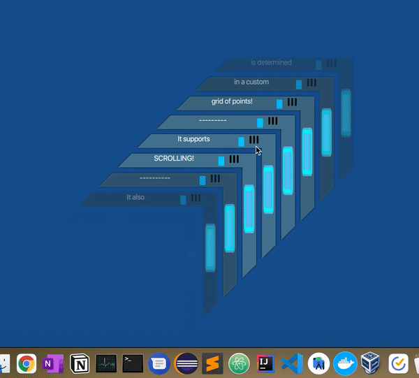
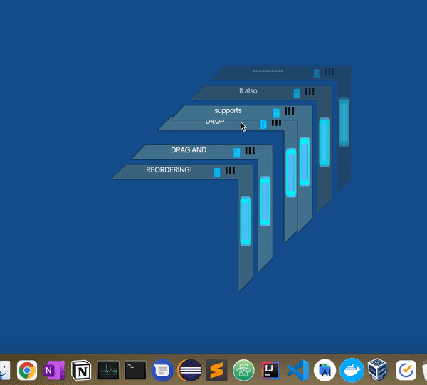

# JavaFX scrolling challenge

I made this at a time in which I was workshopping a concept for an app which I called "4wards". I wanted to make a scrolling and drag/drop capable list which felt different from the apps available at the time. Since I was learning software development in the Java ecosystem, and since I wanted to make a desktop app, I chose JavaFX to develop this. Later, the "4wards" concept evolved into a mobile-first design which you can learn more about [here](https://github.com/tunepruner/4wards). 

This is a very naive implementation, made by a very novice version of myself. It's an extremely inefficient algorithm that re-calculates the x-y position of each item on the screen according to the movement of the scroll wheel and mouse drag. Consider this a chance to see what somebody comes up with for concepts like these when they've never actually seen those things implemented correctly.
